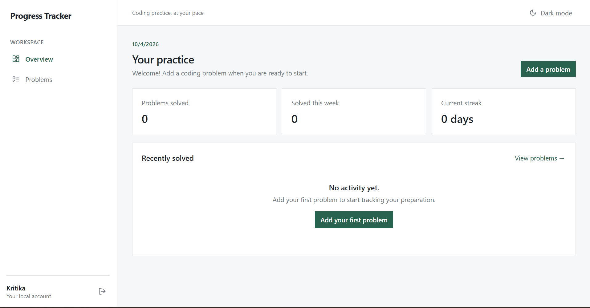
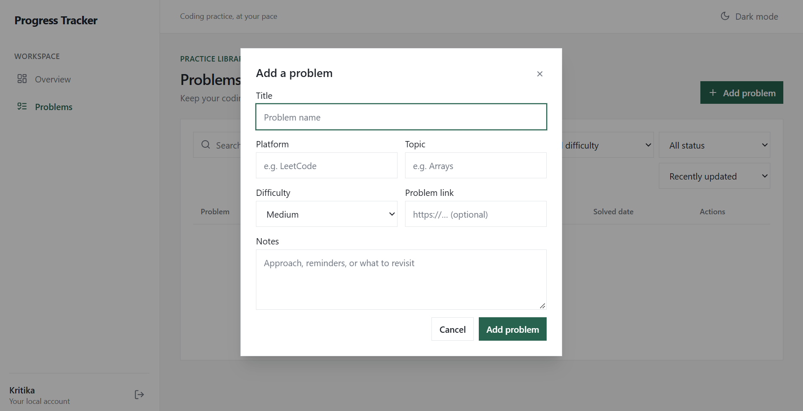

# Progress Tracker System

Progress Tracker System is a React-based coding practice and progress tracking application designed to help students organize DSA problems, monitor solving consistency, and track preparation progress.

## Overview

The application helps students maintain a personal coding-problem library, record solving progress, and review preparation activity from a simple browser interface.

The project started as a C++ CLI-based tracker and was later extended into a browser-based React application. The original CLI project remains preserved in the repository.

## Features

- Add, edit, and delete coding problems
- Mark problems as solved or unsolved
- Search and filter problems
- Track platform, topic, difficulty, links, notes, and status
- Dashboard progress overview
- Analytics and progress insights
- Daily goals
- Streak tracking
- Revision tracking
- Dark mode
- Responsive interface for desktop and mobile

## Tech Stack

- React
- Vite
- Tailwind CSS
- Lucide React
- LocalStorage

## Data Storage

The current browser application stores user accounts, theme preferences, and coding-problem data in LocalStorage. No backend or database is required to run the application locally.

## Project Structure

```text
Progress-Tracker-System/
├── Tracker.cpp
├── tracker_data.csv
├── run_tracker.bat
├── readme.md
└── web-app/
    └── frontend/
```

The original C++ CLI project is preserved at the repository root. The React browser application is located in `web-app/frontend`.

## Running the Web App

From the repository root, run:

```bash
cd web-app/frontend
npm install
npm run dev
```

Open the local URL printed by Vite in your browser.

## Screenshots





## Project Evolution

```text
C++ CLI → React browser application
```

The project evolved from a terminal-based DSA tracker into a browser-based application while preserving the original C++ implementation and data files.
